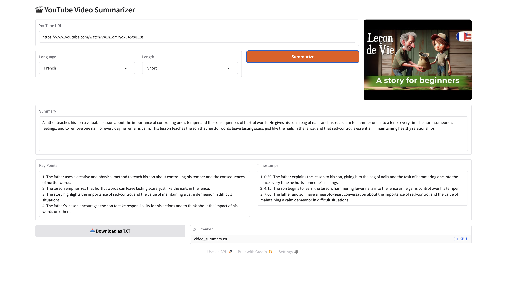
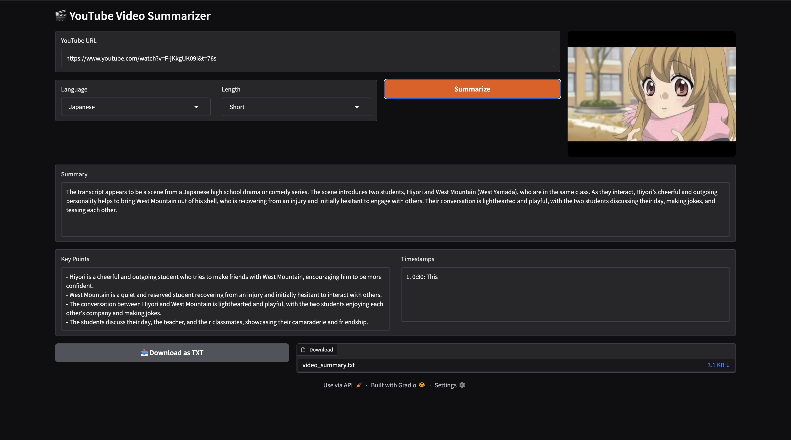
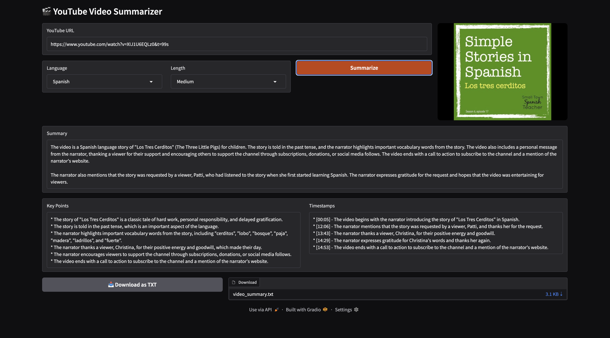
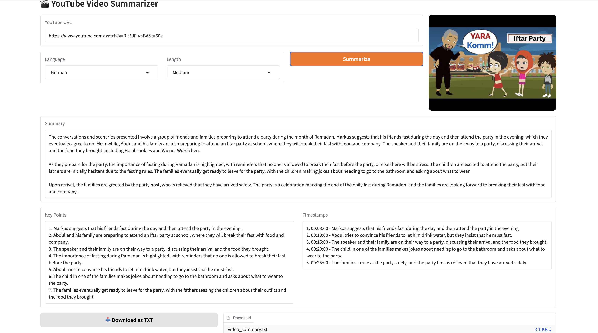
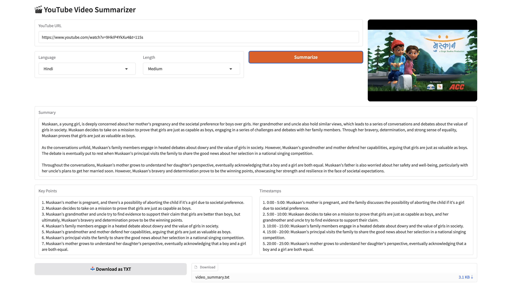
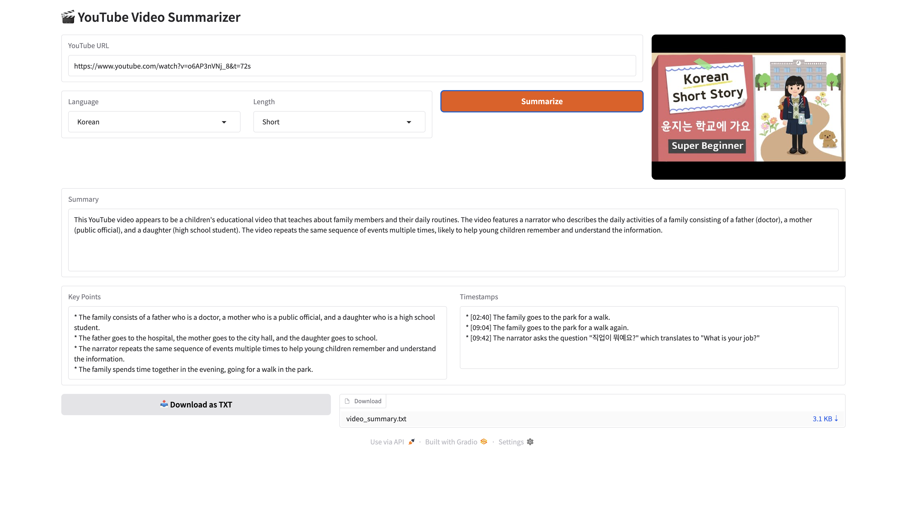
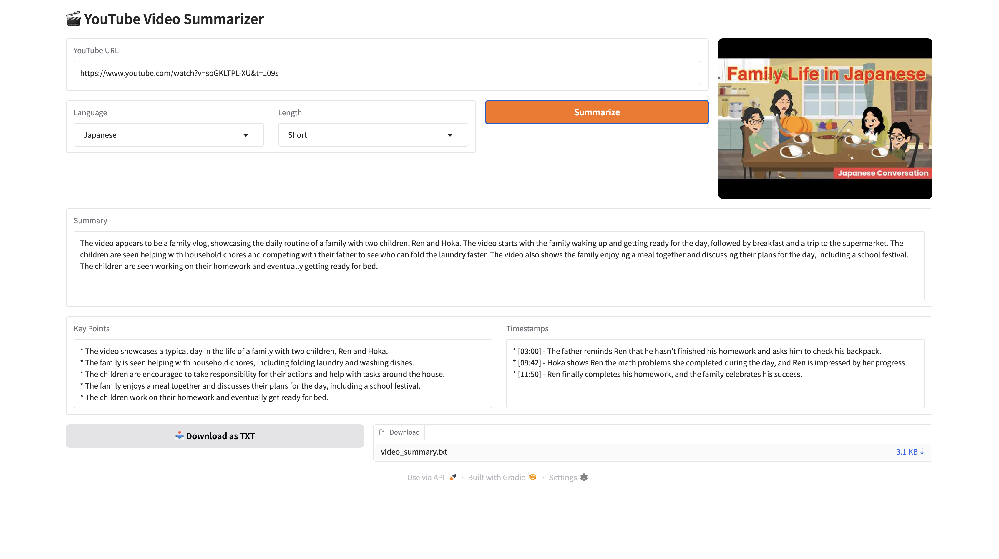
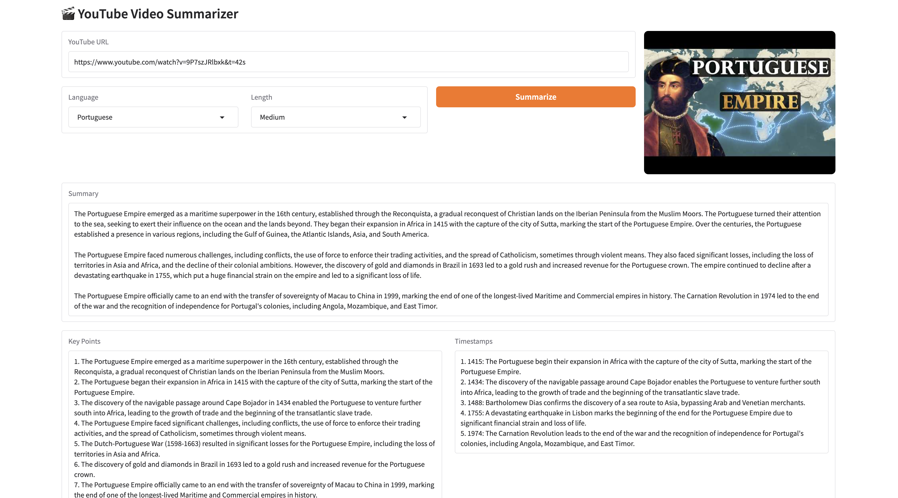
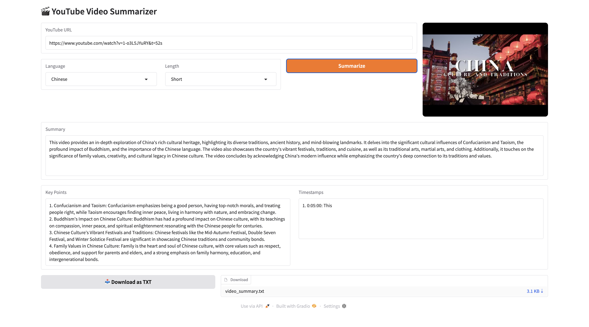
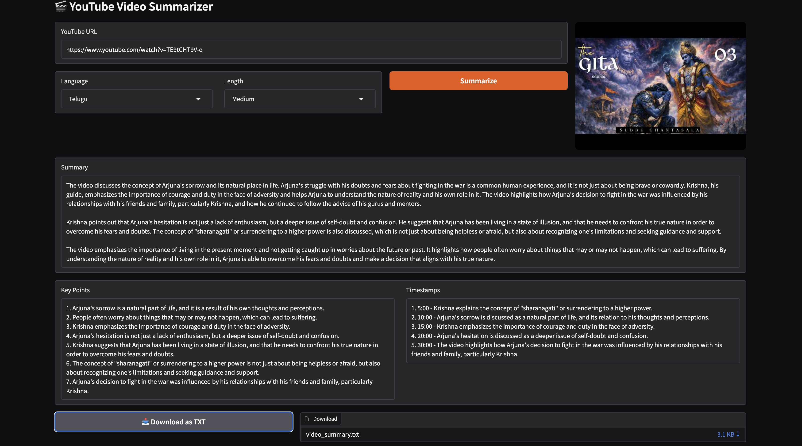

# YouTube Video Summarizer 🎬

Too long to watch? Let AI do it for you.

Paste a YouTube link → Get a summary, key points, and timestamps. Works in 12+ languages.

## What It Does

You know those 45-minute videos where you just need the main points? This tool watches them for you (kind of).

- Paste any YouTube URL
- Pick your language and summary length
- Get a clean summary, key points, and timestamps in seconds
- Translate the summary to any language
- Download as TXT or PDF

## Features

- 🌍 **12+ languages** - English, Hindi, Telugu, Spanish, French, and more
- 📺 **Long videos? No problem** - Automatically breaks them into chunks
- 🖼️ **Thumbnail preview** - See what you're summarizing
- 📝 **Flexible length** - Short, Medium, or Detailed
- 🌐 **Translate summary** - Translate to Telugu, Hindi, Spanish, and 10+ languages
- 💾 **Export** - Download as TXT or PDF

## How I Built This

- **Groq API** - Super fast AI inference (Llama 3.1 8B)
- **Supadata API** - Fetches YouTube captions/transcripts
- **Gradio** - Simple web interface
- **Python** - Glues everything together

## Live Demo

Try it on Hugging Face Spaces: [YouTube Video Summarizer](https://huggingface.co/spaces/Archanacreates/youtube-summarizer)

## Run Locally

1. Clone this repo:
```bash
git clone https://github.com/archana-gurimitkala/-groq-youtube-summarizer-.git
cd -groq-youtube-summarizer-
```

2. Install dependencies:
```bash
pip install -r requirements.txt
```

3. Get your API keys:
   - Groq API key: https://console.groq.com
   - Supadata API key: https://supadata.ai

4. Create `.env` file:
```
GROQ_API_KEY=your-groq-key-here
SUPADATA_API_KEY=your-supadata-key-here
```

5. Run it:
```bash
python app.py
```

6. Open http://localhost:7860 and start summarizing!

## Screenshots

> **Note:** These screenshots show the original version. The latest version includes **Translate Summary** and **PDF/TXT export** features — try them live on [Hugging Face Spaces](https://huggingface.co/spaces/Archanacreates/youtube-summarizer)!












---

*Built because I got tired of watching entire videos for 2 minutes of useful content* 😅
